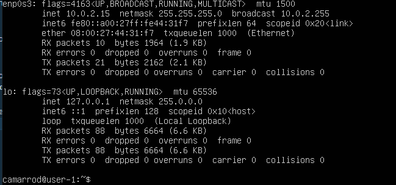

## Задание 1

1.  Графический интерфейс должен отсутствовать.

2.  Выполнение команды \cat /etc/issue.`

3.  Скриншот с выводом команды.

## Задание 2

1.  Скриншот вызова команды, для создания пользователя.

2.  Новый пользователь должен быть в выводе команды, также в какой группе находится новый пользователь

`grep adm /etc/group`

`cat /etc/passwd`

## Задание 3

1. Задать название машины вида user-1, также сразу виден вывод ifconfig.
   `sudo hostname user-1`
   

2. Установить временную зону, соответствующую вашему текущему местоположению.
   `timedatectl`
   

3. Вывести названия сетевых интерфейсов с помощью консольной команды.
   `ifconfig`
   

- Интерфейс lo - виртуальный интерфейс, для коммуникации с самим устройством. Cредство тестирования коммуникационной инфраструктуры.Если для пакета, исходящего от локального процесса, на сетевом уровне выходным интерфейсом выбран loopback, то пакет не достигает ни канального ни физического уровня OSI, а немедленно подается обратно на вход системы, т. е. во входную очередь интерфейса loopback.

4.  Используя консольную команду получить ip адрес устройства, на котором вы работаете, от DHCP сервера.
    

- DHCP расшифровывается как "Dynamic Host Configuration Protocol" (Протокол динамической конфигурации хоста). DHCP является сетевым протоколом, который позволяет компьютерам и другим устройствам автоматически получать сетевую конфигурацию, включая IP-адрес, подсеть, шлюз по умолчанию и другие параметры, от DHCP-сервера в локальной сети.

5.  Определить и вывести на экран внешний ip-адрес шлюза (ip) и внутренний IP-адрес шлюза, он же ip-адрес по умолчанию (gw).

- внешний ip-адрес шлюза (ip):

  

- внутренний IP-адрес шлюза:

  

6. Задать статичные (заданные вручную, а не полученные от DHCP сервера) настройки ip, gw, dns (использовать публичный DNS серверы, например 1.1.1.1 или 8.8.8.8).

`sudo vim /etc/netplan/00-installer-config.yaml`

7. Перезагрузить виртуальную машину. Убедиться, что статичные сетевые настройки (ip, gw, dns) соответствуют заданным в предыдущем пункте.

-Успешно пропинговать удаленные хосты 1.1.1.1 и ya.ru и вставить в отчёт скрин с выводом команды.

## Задание 4

1. Обновить системные пакеты до последней на момент выполнения задания версии.
2. Вставить скриншот с этим сообщением в отчёт.
   

## Задание 5

1.Разрешить пользователю, созданному в Part 2, выполнять команду sudo.
-sudo - это команда в операционной системе Linux, которая позволяет пользователю выполнять команды от имени суперпользователя (root), обладающего расширенными привилегиями и доступом ко всем системным ресурсам. С помощью команды sudo можно выполнять опасные или привилегированные операции, такие как установка программ, изменение системных настроек или управление службами, при этом требуя подтверждения паролем от текущего пользователя.

2. Поменять hostname ОС от имени пользователя, созданного в пункте [Part 2](#part-2-создание-пользователя). (используя sudo).
3. Вставить скрин с изменённым hostname в отчёт.

## Задание 6

1. Вывести время, часового пояса, в котором вы сейчас находитесь.
2. Вывод следующей команды должен содержать `NTPSynchronized=yes`: \
   `timedatectl show`
3. Вставить скрины с корректным временем и выводом команды в отчёт.

## Задание 7

1. Установить текстовые редакторы VIM (+ любые два по желанию NANO, MCEDIT, JOE и т.д.)  
   `sudo apt install vim`  
   `sudo apt install nano`  
   `sudo apt install mcedit`
2. Используя каждый из трех выбранных редакторов, создайте файл test_X.txt, где X -- название редактора, в котором создан файл. Напишите в нём свой никнейм, закройте файл с сохранением изменений.
3. Используя каждый из трех выбранных редакторов, откройте файл на редактирование, отредактируйте файл, заменив никнейм на строку "21 School 21", закройте файл без сохранения изменений.
4. Используя каждый из трех выбранных редакторов, отредактируйте файл ещё раз (по аналогии с предыдущим пунктом), а затем освойте функции поиска по содержимому файла (слово) и замены слова на любое другое.

-VIM

1. 
2. 
3. 
4. 
5. 

- vim test_vim.txt
- Режим редактирования: i
- Выйти из режима редактирования: esc
- Выход с охранением: :wq
- Выход без сохранения: :q!
- Поиск: /<что ищем>
- Замена: :s/(что вставляем)/(вместо чего вставляем)

-NANO

1. 
2. 
3. 
4. 

- nano test_nano.txt
- Выход с охранением: CTRL + x, затем y и enter
- Выход без сохранения: CTRL + x, затем n
- Поиск: CTRL + W, затем enter (alt + w для перехода к след. вхождению, ctrl + c для прекращения поиска)
- Замена: CTRL + \ + (что хотим изменитьenter) enter (на что хотим заменить), y или n в зависимости хотите ли вы заменить конкретную подстроку.

### MCEDIT

1. 
2. 
3. 
4. 
5. 

- mcedit test_mcedit.txt
- Выход с охранением: F2 (yes) + F10
- Выход без сохранения: F10(no)
- Поиск: F7 + (текст который ищем), выбираем способ поиска + ОК
- Замена: F4 + (что хотим изменить) + (на что хотим заменить) + replace

## Задание 8
