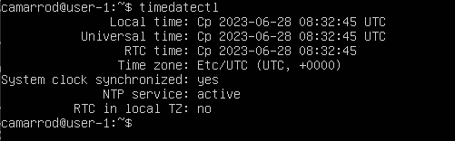

## Задание 1

1.  Графический интерфейс должен отсутствовать.

2.  Выполнение команды \cat /etc/issue.`

3.  Скриншот с выводом команды.

## Задание 2

1.  Скриншот вызова команды, для создания пользователя.

2.  Новый пользователь должен быть в выводе команды, также в какой группе находится новый пользователь

`grep adm /etc/group`

`cat /etc/passwd`

## Задание 3

1. Задать название машины вида user-1, также сразу виден вывод ifconfig.
   `sudo hostname user-1`
   

2. Установить временную зону, соответствующую вашему текущему местоположению.
   `timedatectl`
   

3. Вывести названия сетевых интерфейсов с помощью консольной команды.
   `ifconfig`
   

- Интерфейс lo - виртуальный интерфейс, для коммуникации с самим устройством. Cредство тестирования коммуникационной инфраструктуры.Если для пакета, исходящего от локального процесса, на сетевом уровне выходным интерфейсом выбран loopback, то пакет не достигает ни канального ни физического уровня OSI, а немедленно подается обратно на вход системы, т. е. во входную очередь интерфейса loopback.

4.  Используя консольную команду получить ip адрес устройства, на котором вы работаете, от DHCP сервера.
    

- DHCP расшифровывается как "Dynamic Host Configuration Protocol" (Протокол динамической конфигурации хоста). DHCP является сетевым протоколом, который позволяет компьютерам и другим устройствам автоматически получать сетевую конфигурацию, включая IP-адрес, подсеть, шлюз по умолчанию и другие параметры, от DHCP-сервера в локальной сети.

5.  Определить и вывести на экран внешний ip-адрес шлюза (ip) и внутренний IP-адрес шлюза, он же ip-адрес по умолчанию (gw).

- внешний ip-адрес шлюза (ip):

  

- внутренний IP-адрес шлюза:

6. Задать статичные (заданные вручную, а не полученные от DHCP сервера) настройки ip, gw, dns (использовать публичный DNS серверы, например 1.1.1.1 или 8.8.8.8).
